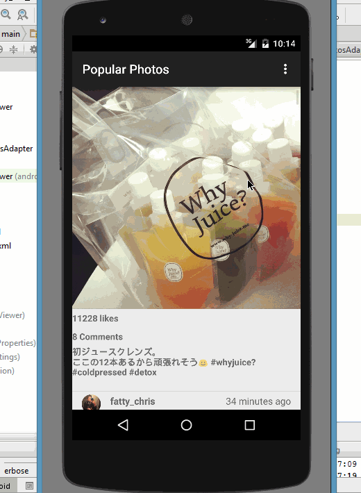

# InstaViewer2
Popular Photo viewer. See the below link for cliffnotes for a step by step tutorial.

Time spent in total: 5 hours 

Completed user stories: 
* [x] Required: User can scroll through current popular photos from Instagram
* [x] Required: For each photo displayed, user can see the following details: Graphic, Caption, Username
*  (Optional) relative timestamp, like count, user profile image
* [x] Advanced: Add pull-to-refresh for popular stream with SwipeRefreshLayout

Walkthrough of all user stories:

